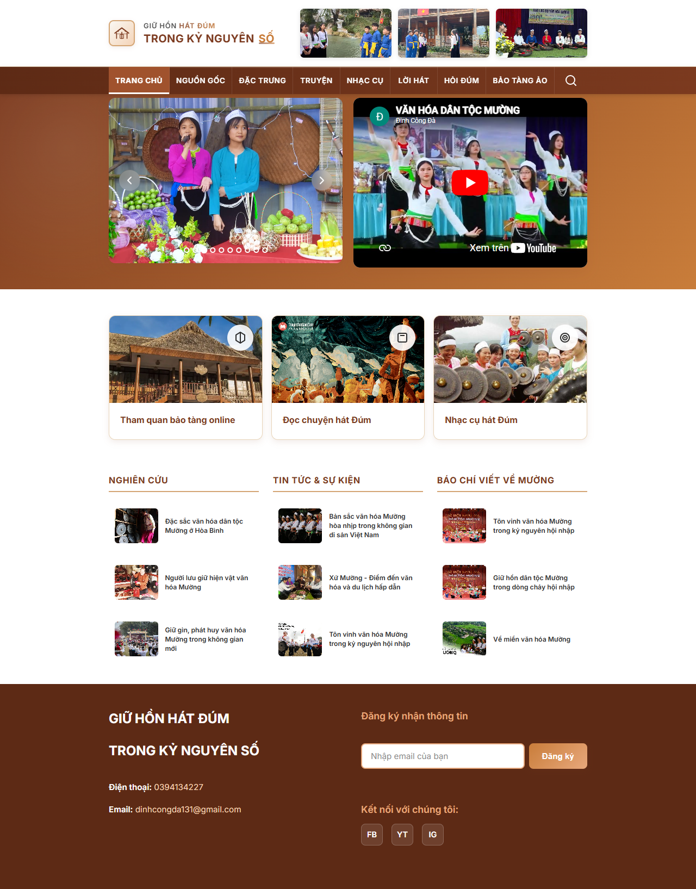
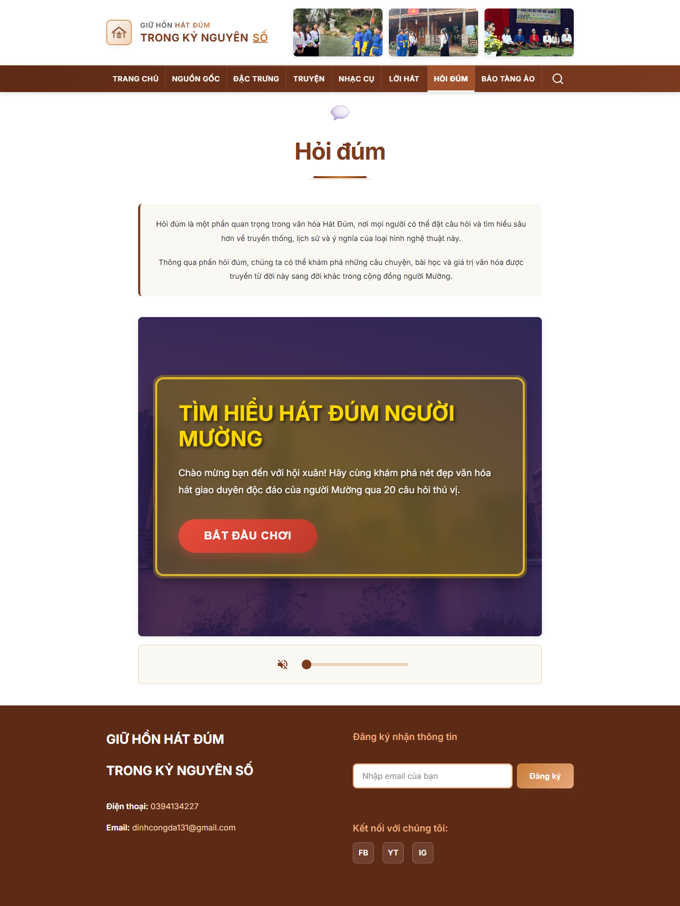
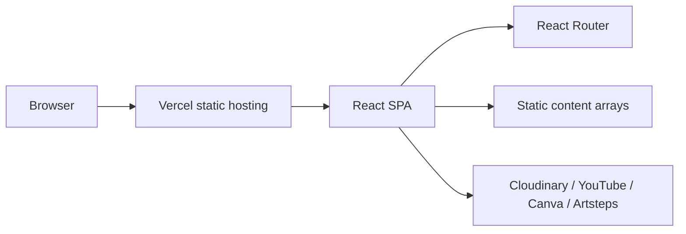

🇬🇧 [Read in English](README.md)

# Giữ hồn Hát Đúm trong kỷ nguyên số


**Live:** [u-i-muongculture.vercel.app](https://u-i-muongculture.vercel.app/)

Đây là website trải nghiệm văn hóa Mường xoay quanh Hát Đúm: nguồn gốc, đặc trưng diễn xướng, nhạc cụ, lời hát, truyện kể, quiz tương tác và bảo tàng ảo. Giá trị chính của repo không nằm ở backend hay dữ liệu phức tạp, mà ở cách gom nhiều loại tư liệu số - ảnh, video, âm thanh, bài báo, Canva, Artsteps - thành một hành trình đọc/xem/nghe chạy được như một SPA tĩnh.

Điểm cần hiểu trước khi sửa: đây là một sản phẩm nội dung. Mọi thay đổi kỹ thuật đều phải bảo vệ ba thứ: tiếng Việt hiển thị đúng, media bên ngoài không làm vỡ trải nghiệm, và tuyến nội dung văn hóa vẫn mạch lạc khi người dùng đi qua từng trang.

## Preview





## Bề mặt sản phẩm

| Route | Vai trò |
|---|---|
| `/` | Trang chủ với carousel ảnh, video YouTube, 3 nhánh truy cập nhanh và cụm bài báo theo nhóm. |
| `/nguon-goc` | Giới thiệu Hát Đúm, đặc trưng diễn xướng và tri thức ngôn ngữ Mường. |
| `/dac-trung` | Tập trung vào âm nhạc, kỹ năng ứng tác lời hát và vai trò cộng đồng. |
| `/truyen` | Nhúng tư liệu Canva và liên kết Gemini cho phần truyện Hát Đúm. |
| `/nhac-cu` | Mô tả Sáo Ôi, Đàn nhị bằng văn bản, ảnh và video Cloudinary. |
| `/loi-hat` | Nhúng tư liệu Canva, kèm audio nền có điều khiển âm lượng. |
| `/hoi-dum` | Quiz 20 câu chạy client-side để người đọc tự kiểm tra hiểu biết. |
| `/trai-nghiem` | Nhúng bảo tàng ảo Artsteps/WebGL. |

## Tech Stack

| Layer | Stack |
|---|---|
| Frontend |   |
| Build |  |
| Routing |  |
| Media |     |
| Deploy |  |

`@vercel/blob` và `dotenv` đang có trong `package.json`, nhưng source hiện tại không import hoặc gọi chúng. Vì vậy README không trình bày chúng như stack đang hoạt động.

## Kiến trúc ngắn



Ứng dụng được deploy như static SPA: Vercel rewrite mọi route về `index.html`, React Router quyết định màn hình, còn media nằm ở các provider ngoài. Thiết kế này phù hợp với một website di sản vì không cần server để render nội dung, nhưng đổi lại độ ổn định phụ thuộc mạnh vào URL Cloudinary, YouTube, Canva và Artsteps.

## Chạy cục bộ

```bash
npm install
npm run dev
```

Build production:

```bash
npm run build
npm run preview
```

## Đọc sâu

- [Đặc tả kỹ thuật](docs/01-technical-specification.md)
- [Mô hình nội dung và media](docs/02-content-and-media-model.md)
- [Vận hành, rủi ro và hướng nâng cấp](docs/03-operations-and-risks.md)

## Trạng thái hiện tại

- Live homepage đã được kiểm tra bằng Playwright.
- Ảnh tài liệu nằm trong `docs/assets/`.
- Trang Bảo tàng ảo phụ thuộc Artsteps/WebGL; khi kiểm tra có cookie overlay và một số cảnh báo từ iframe bên thứ ba.
- Form newsletter, nút search và social link ở footer hiện chỉ là UI tĩnh, chưa có xử lý thật.
