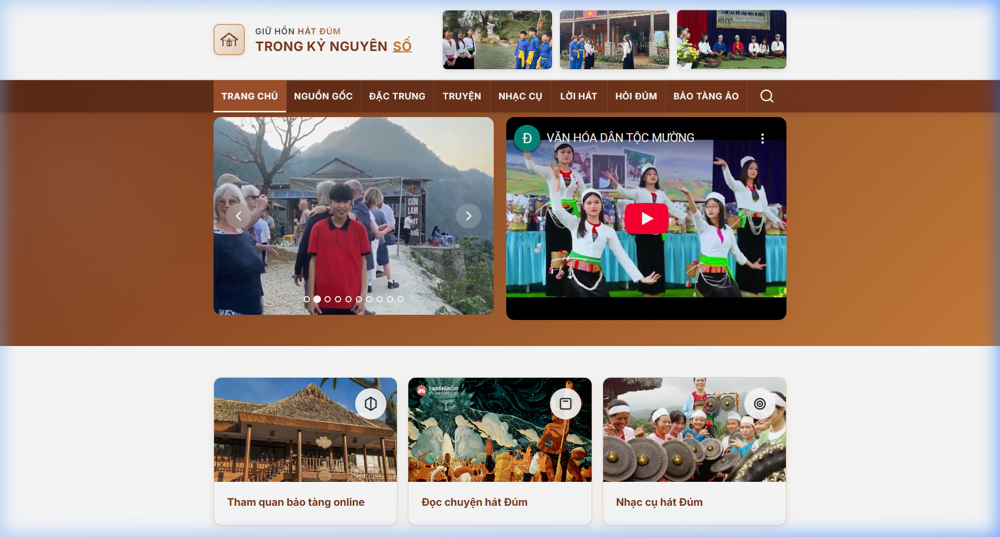

🇻🇳 [Đọc bằng tiếng Việt](README-vi.md)

# UI Muong Culture — Cultural Heritage Platform

  

A cultural heritage website for the Muong ethnic group in Vietnam.

## Preview



## Features

- Cultural content pages with React Router
- Media storage with Vercel Blob
- Responsive design

## Getting started

```bash
git clone https://github.com/initforge/u.i-muongculture.git
cd u.i-muongculture
npm install && npm run dev
```

---

**Xuan Linh** — Fullstack Developer

[](https://github.com/initforge) [](https://linkedin.com/in/linhnx-dev)
