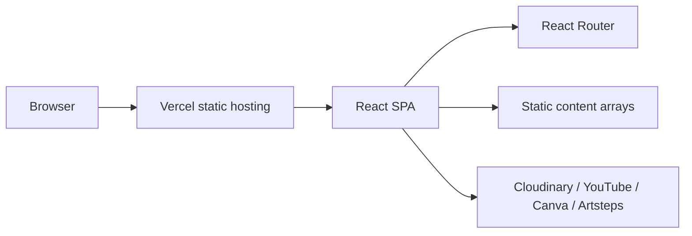

🇻🇳 [Đọc bằng tiếng Việt](README-vi.md)

# Preserving Hat Dum in the Digital Age


**Live:** [u-i-muongculture.vercel.app](https://u-i-muongculture.vercel.app/)

This repository is a static React experience for Muong cultural heritage, centered on Hat Dum: origin, performance characteristics, instruments, lyrics, stories, an interactive quiz, and a virtual museum. Its main challenge is not backend complexity; it is keeping a culturally specific content journey coherent while relying on several external media surfaces.

The project should be maintained as a content product. Technical changes need to protect Vietnamese typography, media availability, and the route-by-route learning flow.

## Preview


## Product Surface

| Route | Role |
|---|---|
| `/` | Homepage with image carousel, YouTube video, three service cards, and grouped news links. |
| `/nguon-goc` | Origin, performance setting, and Muong-language context. |
| `/dac-trung` | Musical characteristics, lyric improvisation, and community role. |
| `/truyen` | Canva story embed plus a Gemini external link. |
| `/nhac-cu` | Sao Oi and Dan Nhi sections with Cloudinary images/videos. |
| `/loi-hat` | Canva lyric embed with muted-by-default background audio controls. |
| `/hoi-dum` | 20-question client-side quiz. |
| `/trai-nghiem` | Artsteps/WebGL virtual museum embed. |

## Tech Stack

| Layer | Stack |
|---|---|
| Frontend |   |
| Build |  |
| Routing |  |
| Media |     |
| Deploy |  |

`@vercel/blob` and `dotenv` are present in `package.json`, but the current source does not import or call them. They are not treated as active runtime stack.

## Runtime Shape


```mermaid
flowchart LR
  Browser["Browser"]
  Vercel["Vercel static hosting"]
  App["React SPA"]
  Router["React Router"]
  Media["Cloudinary / YouTube / Canva / Artsteps"]
  Data["Static content arrays"]

  Browser --> Vercel --> App --> Router
  App --> Data
  App --> Media
```

Vercel rewrites all paths to `index.html`, React Router chooses the screen, and the page loads media from external providers. That is a reasonable fit for a cultural microsite because content can ship without a backend, but it also means external embeds are part of the operational surface.

## Local Run

```bash
npm install
npm run dev
```

Production build:

```bash
npm run build
npm run preview
```

## Read Next

- [Technical specification](docs/01-technical-specification.md)
- [Content and media model](docs/02-content-and-media-model.md)
- [Operations, risks, and roadmap](docs/03-operations-and-risks.md)

## Current State

- The live homepage was checked with Playwright.
- Documentation screenshots live under `docs/assets/`.
- The virtual museum depends on Artsteps/WebGL; browser checks showed a third-party cookie overlay and iframe-level warnings.
- The newsletter form, search button, and footer social links are currently static UI only.
