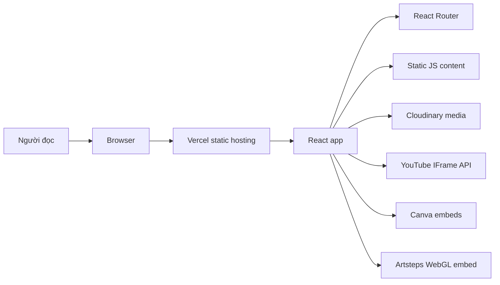

# Đặc tả kỹ thuật - Giữ hồn Hát Đúm trong kỷ nguyên số

> Mục đích: giải thích hệ thống đang được thiết kế như thế nào, vì sao phù hợp với một website di sản tĩnh, và điểm nào cần cẩn trọng khi sửa.

## 1. Tổng quan

Website số hóa một tuyến trải nghiệm về Hát Đúm của người Mường. Người đọc không đăng nhập, không tạo dữ liệu và không đi qua backend. Toàn bộ hành trình diễn ra trong browser: đọc nội dung, xem ảnh/video, mở tư liệu nhúng, nghe audio, chơi quiz và tham quan bảo tàng ảo.

Vì vậy bài toán kỹ thuật chính là **điều phối trải nghiệm media-rich trong một SPA tĩnh**:

- routing phải giữ được nhiều trang nội dung như một website truyền thống;
- media ngoài phải tải đủ ổn để không làm rỗng trải nghiệm;
- audio/video không được tranh nhau phát;
- các trang nhúng Canva/Artsteps phải được xem là dependency vận hành, không phải phần trang trí;
- nội dung tiếng Việt có dấu là dữ liệu sản phẩm, không được xử lý như text phụ.

## 2. Bề mặt ứng dụng

Routes được khai báo trong `src/App.jsx`.

| Route | Component | Nội dung chính |
|---|---|---|
| `/` | `Home` | Carousel 10 ảnh Cloudinary, YouTube IFrame API, 3 service cards, 3 cột bài báo. |
| `/nguon-goc` | `Origin` | Giới thiệu Hát Đúm, đặc trưng diễn xướng, tri thức ngôn ngữ Mường. |
| `/dac-trung` | `Characteristics` | Đặc trưng âm nhạc, kỹ năng tạo lời hát, vai trò của điệu hát Đúm. |
| `/truyen` | `Stories` | Canva embed và nút mở Gemini. |
| `/nhac-cu` | `Instruments` | Sáo Ôi, Đàn nhị, ảnh và video Cloudinary. |
| `/loi-hat` | `Lyrics` | Canva embed, audio nền tắt tiếng mặc định, slider âm lượng. |
| `/hoi-dum` | `HoiDum` | Quiz 20 câu, tính điểm client-side, giải thích sau khi trả lời. |
| `/trai-nghiem` | `Experience` | Artsteps embed cho bảo tàng ảo. |

Không có route API, database, auth, CMS nội bộ hoặc server action trong source hiện tại.

## 3. Kiến trúc runtime

`vercel.json` rewrite mọi request về `/index.html`. Đây là quyết định đúng với React Router: người dùng có thể reload trực tiếp `/hoi-dum` hoặc `/trai-nghiem` mà không bị 404 ở tầng hosting.

### Tại sao không cần backend?

Nội dung hiện tại là public, không có dữ liệu người dùng, không có quản trị nội dung trong app và không có workflow cần persistence. Backend chỉ làm tăng độ phức tạp vận hành nếu chưa có nhu cầu biên tập động, tracking hoặc lưu kết quả quiz.

### Khi nào nên thêm backend?

Chỉ nên thêm backend khi có ít nhất một nhu cầu thật:

- quản trị bài viết/media qua CMS;
- lưu điểm quiz hoặc lịch sử tham gia;
- thu thập email newsletter thật;
- proxy media để kiểm soát availability;
- thêm analytics/event tracking có chủ đích.

Nếu chỉ sửa nội dung tĩnh, tiếp tục giữ mô hình static SPA là hợp lý.

## 4. Tech stack

| Layer | Stack | Bằng chứng |
|---|---|---|
| Frontend | React 18 + JavaScript | `react`, `react-dom` trong `package.json`; `src/main.jsx`. |
| Routing | React Router DOM 6 | `BrowserRouter`, `Routes`, `Route` trong `src/App.jsx`. |
| Build | Vite 5 | `vite`, `@vitejs/plugin-react`, `vite.config.js`. |
| Hosting | Vercel static SPA | `vercel.json` rewrite. |
| Media | Cloudinary URLs | Ảnh, audio, video trong `Home`, `Header`, `Origin`, `Characteristics`, `Instruments`, `Lyrics`, `HoiDum`. |
| Embed | YouTube, Canva, Artsteps | YouTube script ở `index.html`, Canva iframe trong `Stories`/`Lyrics`, Artsteps iframe trong `Experience`. |
| State | React state + DOM globals | React state cho audio/carousel; `HoiDum` gắn hàm quiz lên `window`. |

`@vercel/blob` và `dotenv` có trong dependencies nhưng chưa có import trong source. Chúng nên được xem là dependency dư hoặc dấu vết ý tưởng cũ cho tới khi có code sử dụng thật.

## 5. Luồng nội dung

### 5.1 Trang chủ

Trang chủ là cửa vào của toàn bộ trải nghiệm:

1. Header cố định hiển thị logo, 3 ảnh banner và thanh điều hướng.
2. Hero chia đôi: carousel ảnh Cloudinary và video YouTube `6Lpem8amhxk`.
3. Ba card điều hướng đưa người dùng sang bảo tàng ảo, truyện, nhạc cụ.
4. Cụm bài báo được lấy từ `src/data/news.js`, chia thành `research`, `news`, `press`.

Điểm quan trọng: `newsData` là static array, không fetch từ CMS. Khi bài báo chết link hoặc ảnh không còn tồn tại, phải sửa trực tiếp source.

### 5.2 Audio nền

`App.jsx` tạo một `HTMLAudioElement` global, dùng file Cloudinary `Nhạc_SÁO...m4a`, lưu vị trí phát vào `localStorage` key `homeAudioTime`, và cố unlock audio khi người dùng tương tác.

Lý do thiết kế:

- audio nền chỉ nên phát ở trang chủ;
- khi rời trang chủ thì pause và lưu vị trí;
- khi quay lại trang chủ thì cố resume;
- YouTube đang phát thì `Home.jsx` pause audio nền để tránh hai nguồn âm chồng nhau.

Tradeoff:

- browser có autoplay policy nên audio có thể bị block cho tới khi có tương tác thật;
- code unlock audio hiện khá nhiều nhánh retry/log, dễ nhiễu console;
- audio nằm ngoài React component thông thường nên cần cẩn thận khi refactor StrictMode.

### 5.3 Quiz Hỏi Đúm

`HoiDum.jsx` chứa 20 câu hỏi trong mảng `quizData`. Khi mount, component gắn các hàm `showScreen`, `startGame`, `loadQuestion`, `selectAnswer`, `nextQuestion`, `endGame`, `restartGame` lên `window`, sau đó thao tác DOM bằng `document.getElementById`.

Thiết kế này chạy được cho demo/tĩnh, nhưng là vùng rủi ro kỹ thuật lớn nhất:

- không idiomatic với React;
- khó test bằng component test;
- dễ rò trạng thái nếu component mount/unmount nhiều lần;
- các hàm global có thể bị ghi đè nếu về sau thêm widget khác.

Nếu nâng cấp repo, quiz nên được chuyển về `useState`/component state thuần React.

## 6. Media và provider bên ngoài

| Provider | Đang dùng cho | Rủi ro vận hành |
|---|---|---|
| Cloudinary | Ảnh carousel, banner, bài báo, nhạc cụ; audio/video | URL đổi hoặc asset bị xóa sẽ làm vỡ phần nội dung trực quan. |
| YouTube | Video trang chủ | IFrame API có thể cảnh báo origin/postMessage, autoplay phụ thuộc browser. |
| Canva | Tư liệu truyện và lời hát | Iframe có thể trắng/chậm tùy mạng, cookie, CSP hoặc availability của Canva. |
| Artsteps | Bảo tàng ảo WebGL | Phụ thuộc WebGL, cookie overlay, polyfill/CDN của bên thứ ba và quyền sensor. |
| Pixabay CDN | Âm thanh đúng/sai quiz | Nếu CDN đổi URL, hiệu ứng quiz mất âm thanh nhưng logic vẫn chạy. |

Source không có fallback nội bộ cho các provider này. Docs và vận hành phải coi media external là phần của hệ thống.

## 7. Quyết định kỹ thuật

### Decision: Static SPA thay vì backend/CMS

**Vấn đề:** Website cần nhiều trang nội dung, nhưng chưa có nhu cầu user data hoặc quản trị động.

**Cách hiện tại:** React SPA deploy tĩnh lên Vercel, route do React Router xử lý, nội dung viết trong component/data file.

**Vì sao phù hợp:** Chi phí vận hành thấp, deploy đơn giản, phù hợp với microsite trình diễn văn hóa.

**Không chọn:** Backend/CMS ngay từ đầu. Nó chỉ hợp lý khi có biên tập nội dung thường xuyên hoặc cần lưu dữ liệu người dùng.

**Tradeoff:** Mỗi lần sửa nội dung phải commit/deploy; không có giao diện quản trị.

### Decision: Dùng media provider ngoài

**Vấn đề:** Website cần nhiều ảnh, video, audio và trải nghiệm nhúng, nếu đưa hết vào repo sẽ làm nặng repository.

**Cách hiện tại:** Cloudinary giữ ảnh/audio/video, YouTube/Canva/Artsteps giữ nội dung tương tác.

**Vì sao phù hợp:** Repo nhẹ, build nhanh, không cần pipeline asset phức tạp.

**Tradeoff:** Availability không còn nằm hoàn toàn trong repo; cần kiểm tra link định kỳ.

### Decision: Client-side quiz

**Vấn đề:** Cần một phần tương tác để người dùng tự kiểm tra hiểu biết mà không cần tài khoản.

**Cách hiện tại:** Quiz chạy 100% trong browser, không lưu kết quả.

**Vì sao phù hợp:** Không cần backend, không phát sinh dữ liệu cá nhân.

**Tradeoff:** Không có leaderboard, không có thống kê, không có persistence; implementation hiện dùng DOM globals nên khó bảo trì.

## 8. Kiểm tra runtime đã thực hiện

Playwright kiểm tra live site ngày 25/05/2026:

| Trang | Kết quả |
|---|---|
| `/` | Render tốt, ảnh và YouTube xuất hiện; có warning `postMessage` từ YouTube. |
| `/hoi-dum` | Render quiz tốt; audio bị autoplay policy chi phối nhưng giao diện vẫn dùng được. |
| `/trai-nghiem` | Artsteps embed xuất hiện nhưng có cookie overlay và cảnh báo/lỗi từ iframe WebGL bên thứ ba. |
| `/truyen` | Canva iframe có thể render vùng trắng trong capture nếu nội dung nhúng tải chậm hoặc bị chặn. |

Các lỗi/cảnh báo này không nằm trực tiếp trong React app, nhưng ảnh hưởng đến cảm nhận sản phẩm. Khi nâng cấp, cần ưu tiên fallback UI cho iframe.
