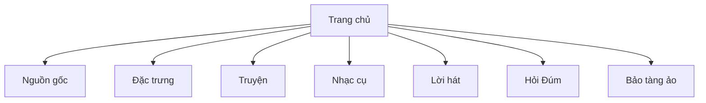

# Mô hình nội dung và media

Tài liệu này mô tả cách repo tổ chức nội dung văn hóa. Với một website di sản, content model là phần quan trọng ngang với code: sai link, sai thứ tự trải nghiệm hoặc sai ngữ cảnh có thể làm sản phẩm mất giá trị dù build vẫn xanh.

## 1. Cấu trúc tuyến đọc

Website đang đi theo một tuyến từ tổng quan đến tương tác:

Trang chủ đóng vai trò như mục lục thị giác. Các trang còn lại là các lát cắt nội dung: lịch sử, diễn xướng, âm nhạc, tư liệu kể chuyện, tương tác hỏi đáp và trải nghiệm ảo.

## 2. Nội dung tĩnh trong component

Phần lớn văn bản nằm trực tiếp trong JSX:

| Khu vực | File |
|---|---|
| Nguồn gốc và tri thức ngôn ngữ | `src/pages/Origin/Origin.jsx` |
| Đặc trưng âm nhạc, ứng tác lời hát | `src/pages/Characteristics/Characteristics.jsx` |
| Nhạc cụ Sáo Ôi, Đàn nhị | `src/pages/Instruments/Instruments.jsx` |
| Giới thiệu lời hát | `src/pages/Lyrics/Lyrics.jsx` |
| Giới thiệu Hỏi Đúm và quiz | `src/pages/HoiDum/HoiDum.jsx` |
| Bảo tàng ảo | `src/pages/Experience/Experience.jsx` |

Ưu điểm của cách này là dễ deploy và không cần CMS. Nhược điểm là nội dung bị trộn với layout, khó tái sử dụng, khó rà soát chính tả hàng loạt, và mỗi chỉnh sửa nội dung đều là chỉnh source.

Nếu dự án phát triển thành kho tư liệu thật, bước nâng cấp hợp lý là tách nội dung sang JSON/Markdown hoặc một CMS nhẹ, nhưng vẫn giữ route hiện tại để không làm mất tuyến trải nghiệm.

## 3. Bài báo ngoài

`src/data/news.js` chứa 9 mục bài báo, chia thành ba nhóm:

- `research`: nghiên cứu/tư liệu nền;
- `news`: tin tức và sự kiện;
- `press`: báo chí viết về Mường.

Mỗi item gồm `id`, `title`, `excerpt`, `image`, `date`, `link`, `category`. Trang chủ filter theo `category` rồi render thành 3 cột.

Điểm cần chú ý:

- `excerpt` và `date` hiện chưa hiển thị trong layout trang chủ, nhưng vẫn là dữ liệu có thể dùng về sau.
- Link ngoài không có kiểm tra sống/chết tự động.
- Ảnh bài báo vẫn dùng Cloudinary, không lấy trực tiếp từ báo gốc.

## 4. Media map

| Loại media | Vị trí dùng | Nguồn |
|---|---|---|
| Banner header | `Header.jsx` | Cloudinary |
| Carousel homepage | `Home.jsx` | Cloudinary |
| Video homepage | `Home.jsx` | YouTube IFrame API |
| Ảnh trang nguồn gốc/đặc trưng | `Origin.jsx`, `Characteristics.jsx` | Cloudinary |
| Video nhạc cụ | `Instruments.jsx` | Cloudinary MP4 |
| Audio nền | `App.jsx`, `Lyrics.jsx`, `HoiDum.jsx` | Cloudinary M4A |
| Tư liệu truyện/lời hát | `Stories.jsx`, `Lyrics.jsx` | Canva iframe |
| Bảo tàng ảo | `Experience.jsx` | Artsteps iframe |
| Âm thanh quiz | `HoiDum.jsx` | Pixabay CDN |

## 5. Ảnh tài liệu

Ảnh phục vụ README/docs nằm trong `docs/assets/`:

| Ảnh | Mục đích |
|---|---|
| `homepage.png` | Bề mặt chính: header, carousel, YouTube, service cards, bài báo. |
| `hoi-dum.png` | Quiz Hỏi Đúm chạy client-side. |
| `virtual-museum.png` | Trạng thái bảo tàng ảo Artsteps khi nhúng bên thứ ba hiện cookie overlay. |

Ảnh cũ `docs/screenshot.png` được thay bằng thư mục assets để tránh để ảnh lẫn với tài liệu Markdown.

## 6. Quy tắc sửa nội dung

Khi sửa nội dung văn hóa:

1. Giữ tiếng Việt có dấu đầy đủ và kiểm tra render thực tế.
2. Không đổi tên route nếu không có redirect.
3. Không thay media URL mà chưa mở thử ảnh/video/audio.
4. Với Canva/Artsteps, kiểm tra iframe bằng browser thật vì build không phát hiện lỗi nhúng.
5. Nếu thêm bài báo, đưa vào `newsData` đúng `category` để trang chủ tự gom cột.
6. Nếu thêm trang mới, cập nhật đồng thời `App.jsx`, `Header.jsx`, README và spec.

## 7. Điểm cần chuẩn hóa về sau

| Vấn đề | Vì sao cần chuẩn hóa |
|---|---|
| Nội dung nằm trong JSX | Khó biên tập và review nội dung độc lập với UI. |
| Quiz dùng `window.*` và DOM mutation | Khó test, khó bảo trì, không phù hợp React lâu dài. |
| Form newsletter tĩnh | Người dùng có thể tưởng đã đăng ký thật. |
| Search button chưa có handler | Tạo kỳ vọng sai về tính năng tìm kiếm. |
| Social link là `#` | Nên trỏ link thật hoặc ẩn nếu chưa dùng. |
| Provider ngoài không có fallback | Iframe trắng/cookie overlay làm trải nghiệm bị cụt. |
